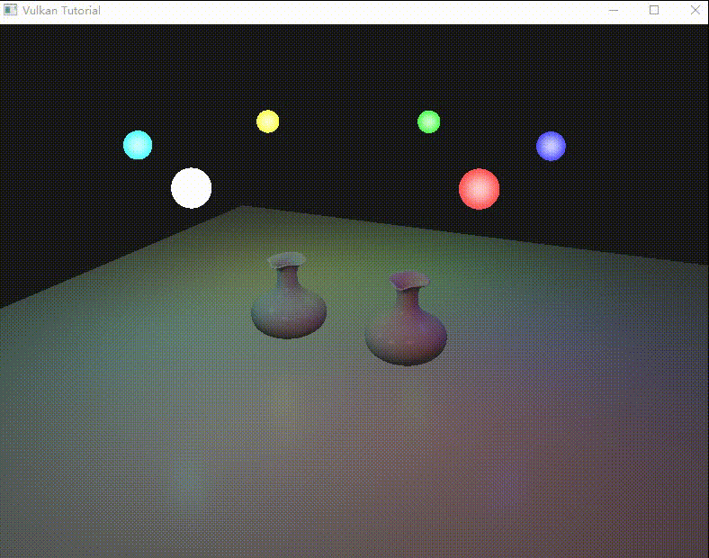

# VulkanStudy
record the Vulkan tutorial & just code files.this project exclude fundamental env

Thanks to the following organizations and authors for their tutorials:
## My Learning Record:
### Beginner:
[**Official Khronos Vulkan Samples**](https://docs.vulkan.org/tutorial/latest/00_Introduction.html) 
[**Brendan Galea Vulkan Turorial**](https://www.youtube.com/watch?v=Y9U9IE0gVHA&list=PL8327DO66nu9qYVKLDmdLW_84-yE4auCR&index=1&t=0s)
### Code execution effect :

 
